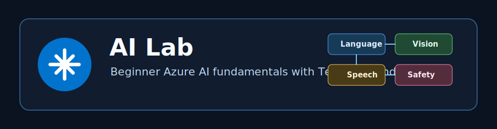
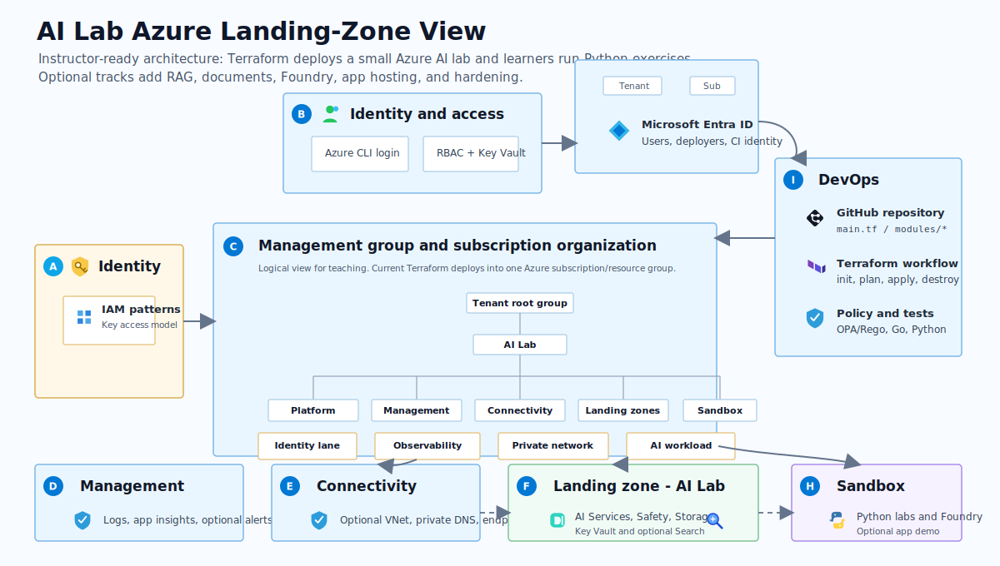
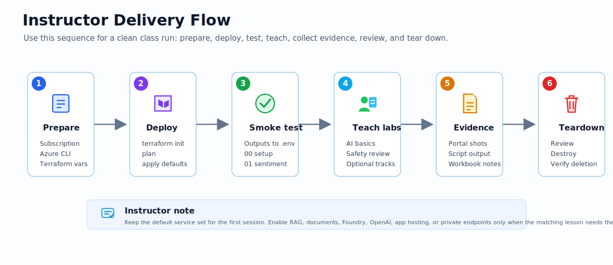
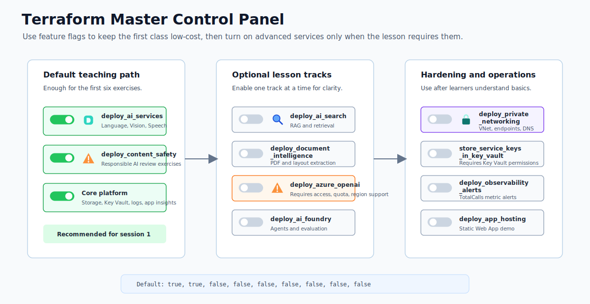
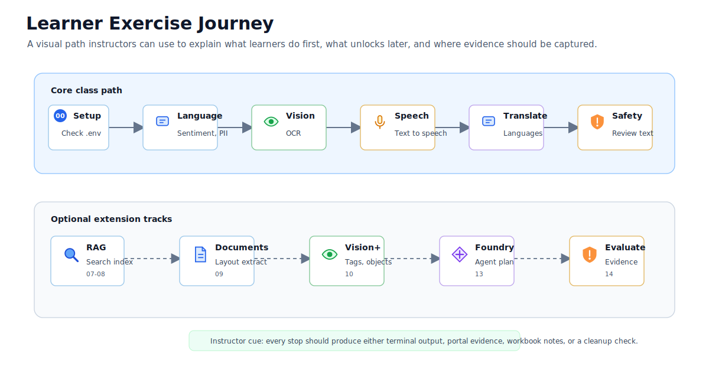

# AI Lab

[](https://terraform.io)
[](https://azure.microsoft.com)
[](https://python.org)
[](LICENSE)

<p align="center">
  
</p>

AI Lab is an instructor-ready Azure AI lab with Terraform and Python. It gives facilitators a low-cost, repeatable classroom environment for teaching Azure AI fundamentals, responsible AI, retrieval, document intelligence, Foundry-oriented agent planning, evaluation, and operational hardening.

The lab is intentionally smaller than a production AI platform. That is the point: learners can deploy real Azure resources, run clear Python exercises, capture evidence, understand cost and quota tradeoffs, and tear everything down before the session ends.

## Why this works for teaching

| Teaching need | How AI Lab supports it |
|---------------|------------------------|
| Fast onboarding | Default Terraform settings deploy the minimum services needed for the first exercises. |
| Clear progression | Learners move from setup to Language, Vision, Speech, Translator, Content Safety, and optional advanced tracks. |
| Visible architecture | Azure-style diagrams show identity, DevOps, management, connectivity, workload, sandbox, and governance lanes. |
| Controlled cost | Optional services stay off until the matching lesson needs them. |
| Evidence capture | Workbook, runbooks, smoke tests, and outputs help learners prove what they built and tested. |
| Safe teardown | Cleanup guidance is explicit so class resources do not linger. |

## Azure-style architecture

<p align="center">
  
</p>

The default deployment creates one Azure resource group with shared platform services and the beginner AI services. Optional tracks add Search/RAG, Document Intelligence, Azure OpenAI, AI Foundry, Static Web App hosting, private endpoints, and call-volume alerts.

| Component | Purpose | Default |
|-----------|---------|---------|
| Resource group | Container for all lab resources | On |
| Storage account | Exercise data and future app artifacts | On |
| Key Vault | Secret store for future hardening exercises | On |
| Log Analytics | Central logs and monitoring foundation | On |
| Application Insights | Optional app observability | On |
| AIServices account | Foundry Tools account for Language, Vision, Speech, and Translator exercises | On |
| Content Safety account | Responsible AI review exercises | On |
| Azure AI Search | Search/RAG exercises | Off |
| Document Intelligence | Document extraction exercises | Off |
| Azure OpenAI | Optional model deployment for quota-enabled subscriptions | Off |
| Azure AI Foundry | Optional hub and project for agent/evaluation work | Off |
| Static Web App | Optional hosted demo placeholder | Off |
| Private endpoints | Optional advanced network hardening | Off |
| Monitor alerts | Optional call-volume guardrail alerts | Off |

## Instructor delivery flow

<p align="center">
  
</p>

Use this flow for a classroom or workshop:

1. Prepare the Azure subscription, Azure CLI login, Terraform version, and variable file.
2. Deploy the default lab with Terraform.
3. Copy Terraform outputs into `exercises/python/.env`.
4. Run setup and smoke tests before learners start.
5. Guide the core exercises, then enable optional tracks only when needed.
6. Capture evidence in the workbook.
7. Review cost, security, and responsible AI decisions.
8. Destroy the lab and verify deletion.

## Master Control Panel

<p align="center">
  
</p>

Copy `terraform.tfvars.example` to `terraform.tfvars`, then choose the lesson scope with feature flags:

```hcl
deploy_ai_services    = true
deploy_content_safety = true
deploy_ai_search      = false
deploy_document_intelligence = false
deploy_azure_openai   = false
deploy_ai_foundry     = false
deploy_app_hosting    = false
deploy_private_networking = false
deploy_observability_alerts = false
```

Beginner defaults keep cost and quota risk low. Turn on optional components only when the related scenario asks for them.

## Choose your track

| Track | Enable | Best for | Instructor note |
|-------|--------|----------|-----------------|
| Core AI fundamentals | Defaults | First workshop or AI-900 style intro | Run setup through Content Safety before adding optional services. |
| Search and RAG | `deploy_ai_search = true` | Retrieval and grounded-answer demos | Keep the Search SKU free for beginner labs. |
| Document extraction | `deploy_document_intelligence = true` | Layout, table, and document structure lessons | Usage is metered, so keep sample volume small. |
| OpenAI and Foundry | `deploy_azure_openai`, `deploy_ai_foundry` | Agent, evaluation, and model orchestration discussions | Confirm access, quota, and regional model availability first. |
| App demo | `deploy_app_hosting = true` | Showing a lightweight hosted scenario console | Use after learners understand the Python calls. |
| Hardening | `deploy_private_networking`, `store_service_keys_in_key_vault`, `deploy_observability_alerts` | Security and operations modules | Validate DNS and access paths before disabling public access. |

## Learner journey

<p align="center">
  
</p>

| Scenario | Exercise | Skills |
|----------|----------|--------|
| Setup check | `00_setup_check.py` | Environment validation, redacted config review |
| Text sentiment | `01_language_sentiment.py` | REST calls, sentiment labels, confidence scores |
| PII and entities | `02_language_pii_entities.py` | Entity extraction, privacy review |
| Vision OCR | `03_vision_ocr.py` | Image analysis, read results |
| Speech basics | `04_speech_basics.py` | Speech region, token, text-to-speech |
| Translator | `05_translator.py` | Translation endpoint, target languages |
| Content Safety | `06_content_safety.py` | Harm categories, severities |
| Optional RAG | `07_search_rag_optional.py` | Search index, tiny document retrieval |
| Advanced RAG | `08_search_rag_advanced.py` | Vector search, hybrid retrieval, citation sources |
| Document Intelligence | `09_document_intelligence_layout.py` | Layout extraction, tables, page summaries |
| Vision analysis | `10_vision_image_analysis.py` | Captions, tags, objects, people, read results |
| Guardrails | `11_content_safety_guardrails.py` | Prompt Shields and protected material checks |
| Pronunciation | `12_speech_pronunciation_assessment.py` | Speech scoring and generated evidence audio |
| Agent blueprint | `13_foundry_agent_blueprint.py` | Foundry-oriented tool catalog and handoff rules |
| Evaluation | `14_observability_evaluation.py` | Groundedness, latency, and local JSONL evidence |

## Quick Start

### 1. Sign in to Azure

```powershell
az login
az account set --subscription "<subscription-id>"
```

### 2. Configure Terraform

```powershell
Copy-Item terraform.tfvars.example terraform.tfvars
terraform init
terraform plan
terraform apply
```

### 3. Configure Python exercises

```powershell
cd exercises/python
python -m venv .venv
.\.venv\Scripts\Activate.ps1
pip install -r requirements.txt
Copy-Item .env.example .env
```

### 4. Fill exercise environment values

Run Terraform outputs from the repository root:

```powershell
cd ../..
terraform output exercise_environment
terraform output -raw ai_services_key
terraform output -raw content_safety_key
```

Copy the non-secret endpoint values and required secret keys into `exercises/python/.env`.

### 5. Run the first checks

Return to the Python exercises folder:

```powershell
cd exercises/python
python 00_setup_check.py
python 01_language_sentiment.py
```

## Documentation

<p align="center">
  
</p>

| Start here | Purpose |
|------------|---------|
| [Wiki home](wiki/README.md) | Documentation index and quick path. |
| [Book-style guide](wiki/book.md) | End-to-end walkthrough of the codebase and lab flow. |
| [Architecture overview](wiki/architecture/overview.md) | How Terraform modules connect and what gets deployed. |
| [Scenarios](wiki/scenarios/README.md) | Hands-on beginner exercises and optional add-ons. |
| [Deploy and test runbook](wiki/runbooks/deploy-and-test.md) | Exact validation, apply, smoke test, and evidence commands. |
| [Teardown runbook](wiki/runbooks/teardown.md) | Destroy Azure resources and clean local secret-bearing artifacts. |
| [Security and cost guide](wiki/security-and-cost.md) | Defaults, secrets, public access, cost controls, and policy checks. |
| [Workbook](wiki/certifications/lab-workbook.md) | Learner evidence checklist. |
| [Instructor pack](wiki/instructor/lesson-plan.md) | Facilitator flow, timing, demos, and grading. |

## Cost and safety notes

- Default services are designed for low-volume learning.
- Azure AI Search is off by default; the free tier is intended for the optional RAG exercise.
- Document Intelligence, Foundry, private networking, and monitor alerts are off by default.
- Azure OpenAI is off by default because it requires access, model quota, and region availability.
- Public endpoints are enabled by default so local beginner exercises work without private networking.
- Always run `terraform destroy` when finished with the lab.

## Project structure

```text
.
|-- modules/              # Reusable Terraform modules
|-- exercises/python/     # Beginner Python exercises
|-- app/                  # Static scenario console demo
|-- wiki/                 # Lab documentation
|-- scripts/              # Repo quality checks
|-- docs/images/          # SVG diagrams
|-- policies/             # OPA/Rego policy checks
|-- tests/                # Go and Python tests
|-- main.tf               # Root Terraform orchestration
|-- variables.tf          # Inputs and feature toggles
|-- outputs.tf            # Exercise endpoints and resource names
`-- terraform.tfvars.example
```

## References

- [Microsoft Foundry overview](https://learn.microsoft.com/azure/foundry/what-is-foundry)
- [Foundry Tools / Azure AI services](https://learn.microsoft.com/azure/ai-services/what-are-ai-services)
- [Terraform Foundry resources](https://learn.microsoft.com/azure/foundry/how-to/create-resource-terraform)
- [Azure AI Search](https://learn.microsoft.com/azure/search/)

## License

MIT. See [LICENSE](LICENSE).
