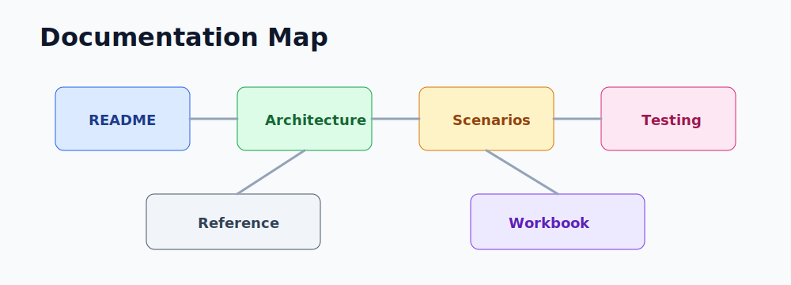

# AI Lab documentation

  

AI Lab is a beginner Azure AI lab that follows the same Terraform-first pattern as the other labs in this workspace. It is built for learners who want to deploy real Azure AI resources, call them from small Python scripts, and understand the tradeoffs before building a larger app.

## What this lab is

- A runnable lab for Azure AI fundamentals.
- A low-cost Terraform scaffold with clear feature toggles.
- A guided exercise set for Language, Vision, Speech, Translator, Content Safety, and optional Search/RAG.
- Optional advanced tracks for Document Intelligence, RAG quality, Foundry agents, evaluation, app demo work, and security hardening.

## What this lab is not

- It is not a production AI platform.
- It does not assume private networking or enterprise governance in v1.
- It does not require Azure OpenAI by default.

## Learning pillars

| Pillar | What it owns |
|--------|--------------|
| Core platform | Resource group, storage, Key Vault, Log Analytics, Application Insights |
| Foundry Tools | AIServices account for beginner AI API calls |
| Responsible AI | Content Safety account and review exercises |
| Retrieval | Optional Azure AI Search for tiny RAG exercises |
| Documents | Optional Document Intelligence account and layout extraction |
| Agent engineering | Optional Foundry hub/project, agent blueprint, and evaluation evidence |
| App path | Optional Static Web App placeholder for later demos |
| Hardening | Optional Key Vault secret storage, private endpoints, alerting, and policy checks |

## Article map

| Topic | What you will learn |
|-------|---------------------|
| [Book-style guide](book.md) | End-to-end walkthrough of the codebase and lab flow. |
| [Architecture overview](architecture/overview.md) | How Terraform modules connect and what gets deployed. |
| [Deploy and test runbook](runbooks/deploy-and-test.md) | Exact commands for validation, apply, smoke tests, and evidence. |
| [Teardown runbook](runbooks/teardown.md) | How to destroy Azure resources and clean local secret-bearing artifacts. |
| [Scenarios](scenarios/README.md) | Hands-on beginner exercises and optional add-ons. |
| [Lab testing guide](testing/lab-testing-guide.md) | How to validate Terraform, Python, and live Azure resources. |
| [Security and cost guide](security-and-cost.md) | Defaults, secrets, public access, cost controls, and policy checks. |
| [Troubleshooting](troubleshooting.md) | Common failures and fixes for Terraform, Azure, Python, and exercises. |
| [Advanced tracks](advanced-tracks.md) | Detailed map for all optional enrichment tracks. |
| [Variables reference](reference/variables.md) | Feature toggles and defaults. |
| [Outputs reference](reference/outputs.md) | Values used by the Python exercises. |
| [CI/CD checks](reference/cicd.md) | GitHub Actions jobs and local pre-push commands. |
| [Module guide](modules/README.md) | Terraform module responsibilities. |
| [Instructor lesson plan](instructor/lesson-plan.md) | Facilitator flow, timing, demos, and grading. |
| [Instructor quiz](instructor/quiz.md) | Review questions and answer key. |
| [AI-900 mapping](certifications/ai-900.md) | How the lab maps to Azure AI Fundamentals study. |
| [AI-102 mapping](certifications/ai-102.md) | Optional Azure AI Engineer extension path. |
| [Lab workbook](certifications/lab-workbook.md) | Checklist for learners to capture evidence. |

## Quick path

1. Copy `terraform.tfvars.example` to `terraform.tfvars`.
2. Keep the default feature flags for your first run.
3. Run `terraform init`, `terraform plan`, and `terraform apply`.
4. Copy `exercises/python/.env.example` to `exercises/python/.env`.
5. Copy Terraform outputs into `exercises/python/.env`.
6. Run `00_setup_check.py`, then each exercise in order.
7. Run `terraform destroy` when the session is done.

## Before you start

- Azure subscription with rights to create resource groups and Cognitive Services accounts.
- Terraform 1.9 or later.
- Azure CLI signed in.
- Python 3.8 or later.
- Go 1.21 or later only if you want to run the optional live Go check locally.
- Budget awareness, especially before enabling Azure OpenAI or Search beyond the free SKU.

## Validated path

The documented happy path has been checked with:

- `terraform fmt -check -recursive`
- `terraform init`
- `terraform validate`
- Python unit tests in `tests/python`
- A live Azure apply against the default services
- Live exercise smoke tests for setup, Language, Vision OCR, Speech, Translator, and Content Safety
- Terraform destroy with resource group deletion verification
- Default-off advanced Terraform modules validate in CI
- Repo quality checks for local markdown links, generated artifacts, and secret-like values

Go tests are included in CI. They skip live Azure checks unless `ARM_SUBSCRIPTION_ID` and `AI_LAB_RESOURCE_GROUP` are set.
