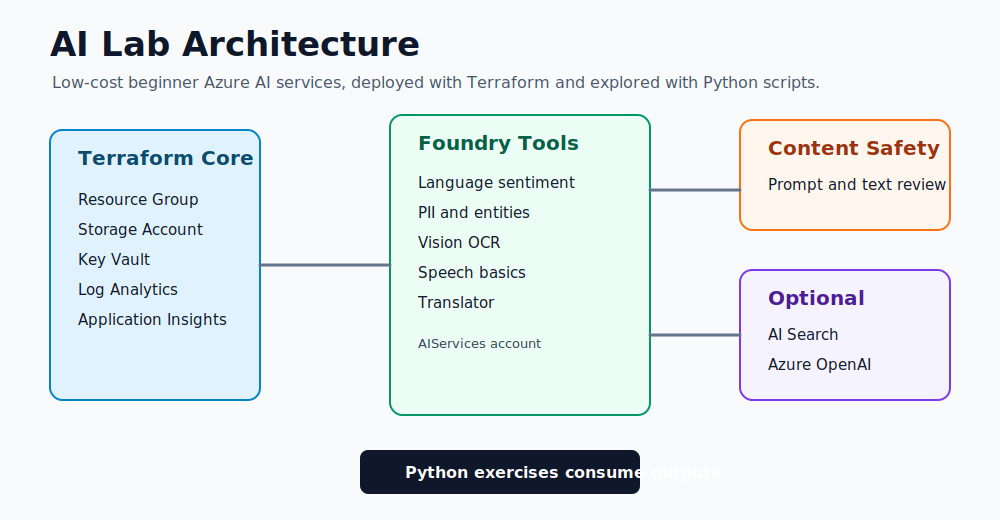

# Architecture overview

<p align="center">
  
</p>

AI Lab uses one resource group and a small set of Azure services. The architecture is intentionally flat so beginners can focus on AI service behavior before learning enterprise networking and governance.

## Resource flow

```text
terraform.tfvars
   |
   v
variables.tf and locals.tf
   |
   v
main.tf root orchestration
   |
   +--> modules/core
   +--> modules/foundry-services
   +--> modules/content-safety
   +--> modules/search            optional
   +--> modules/openai            optional
   `--> modules/app-hosting       optional
```

## Core platform

The core module creates the shared foundation:

| Resource | Purpose |
|----------|---------|
| Resource group | Boundary for all lab resources |
| Storage account | Exercise files and future app artifacts |
| Key Vault | Secret storage for future hardening exercises |
| Log Analytics | Central log workspace |
| Application Insights | Observability for optional app demos |

## AI services

The Foundry Tools module creates an `AIServices` account. Learners use this for beginner calls such as Language sentiment, PII, Vision OCR, Speech, and Translator.

The Content Safety module creates a separate account because safety review is important enough to be visible as its own learning component.

## Optional services

| Service | Why optional |
|---------|--------------|
| Azure AI Search | Useful for RAG, but not needed for first AI calls. |
| Azure OpenAI | Requires access, quota, and regional model availability. |
| Static Web App | Useful after learners understand API calls from scripts. |

## Naming

The display name is `AI Lab`. Azure resource names use `ailab` plus environment, location short code, and a random suffix to avoid global-name collisions.

