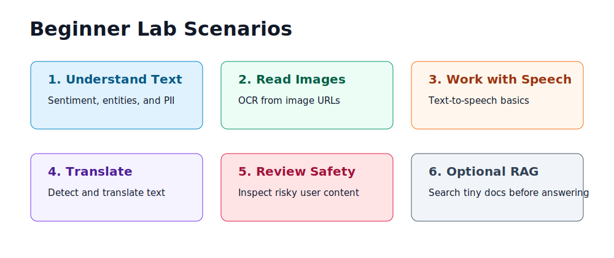

# AI Lab scenarios

<p align="center">
  
</p>

Run the scenarios in order. The first six use the default deployment.

## Scenario 0: Setup check

Script: `exercises/python/00_setup_check.py`

Tasks:

- Confirm `.env` exists.
- Confirm required endpoints and keys are present.
- Print redacted values so learners can confirm configuration without leaking secrets.

Success signal:

- Required variables print.
- Keys are shortened with `...`.
- Optional values show `(not configured)` unless you enabled optional services.

## Scenario 1: Language sentiment

Script: `exercises/python/01_language_sentiment.py`

Tasks:

- Send short text samples to the Language REST API.
- Review sentiment labels and confidence scores.
- Change the sample text and rerun.

Try one positive, one neutral, and one frustrated sentence. Compare the confidence scores and discuss where a user-facing app should avoid overreacting to low confidence.

## Scenario 2: PII and entities

Script: `exercises/python/02_language_pii_entities.py`

Tasks:

- Detect named entities.
- Detect personally identifiable information.
- Discuss why PII handling matters before storing prompts or transcripts.

Evidence to capture:

- Entity categories returned by the API.
- Redacted text from the PII response.
- A note explaining whether your app should store raw input, redacted input, or neither.

## Scenario 3: Vision OCR

Script: `exercises/python/03_vision_ocr.py`

Tasks:

- Analyze an image URL.
- Extract readable text.
- Compare clean printed text with screenshots or handwritten input.

Change the sample URL to another public image with text. OCR quality depends on resolution, contrast, language, and layout.

## Scenario 4: Speech basics

Script: `exercises/python/04_speech_basics.py`

Tasks:

- Request a Speech token.
- Convert a sentence to a small audio file.
- Review why Speech APIs need region information as well as a key.

The script writes `exercises/python/speech-output.wav`. Delete it after testing if you do not need the evidence file.

## Scenario 5: Translator

Script: `exercises/python/05_translator.py`

Tasks:

- Translate a short phrase.
- Change target languages.
- Compare the Translator endpoint with the regional AI Services endpoint.

## Scenario 6: Content Safety

Script: `exercises/python/06_content_safety.py`

Tasks:

- Submit safe and risky text samples.
- Review returned categories and severity levels.
- Decide how an app should handle blocked or escalated content.

Discussion prompts:

- Which severity should block a request?
- Which severity should ask the user to rephrase?
- What should be logged, and what should be redacted?
- Who reviews borderline cases?

## Scenario 7: Optional Search/RAG

Script: `exercises/python/07_search_rag_optional.py`

Required flag:

```hcl
deploy_ai_search = true
```

Tasks:

- Create a tiny local search index.
- Upload three beginner documents.
- Search the index before answering a question.

Clean up optional Search resources by running `terraform destroy` or by turning `deploy_ai_search = false` and applying again.
